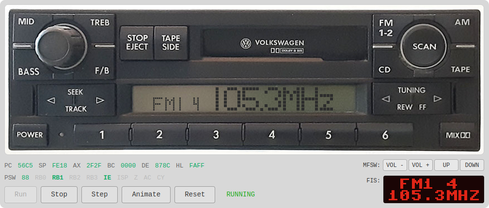

# premium5

                       
This project emulates the Volkswagen [Premium 5](https://github.com/mnaberez/vwradio/tree/main/reverse_engineering/delco/vw_premium_5) car radio made by Delco.  Built on [k0emu](https://github.com/mnaberez/k0emu) and [k0dasm](https://github.com/mnaberez/k0dasm), it runs all known versions of the radio's original firmware without patches.  Its purpose is to aid in continued reverse engineering of the radio and to help test firmware mods.  

The radio's microcontroller and the other peripheral chips on the board are emulated at a low level, i.e. at the register level and with accurate timing.  Emulated components include the undocumented Renesas (NEC) µPD78F0831Y microcontroller (which turned out to be a subset of the [µPD78F0833Y](https://web.archive.org/web/20180328161019if_/https://www.renesas.com/en-us/doc/DocumentServer/021/U13892EJ2V0UM00.pdf)), the [µPD16432B](https://web.archive.org/web/20160611101704if_/http://archive.6502.org/datasheets/nec_upd16432b_2000_dec.pdf) LCD controller (SPI), and the STMicroelectronics M24C04 EEPROM (I2C).  Connections between the major components in the radio are modeled as discrete digital signals.

To test the radio's interaction with other vehicle systems, high-level emulations of those systems are also included.  These include the steering wheel controls (MFSW), instrument cluster display (FIS), and 6-disc CD changer (CDC).  Although these are behavior models rather than emulations of real devices, the radio's interfaces to these systems are emulated faithfully as digital signals with accurate timing.

## Features                                                     

Watch it run in [this video](https://mikenaberezny.com/videos/premium5).  The emulator can:

- Boot and run the original firmware without patches
- Interact with the faceplate (buttons and pixel-perfect LCD)
- Debug using live disassembly and source listing views
- Inspect registers, memory, and EEPROM contents
- Test interaction with related vehicle systems (MFSW, FIS, CDC)
- Step through instructions, run slowly, or emulate in real-time

Note that the emulator does not produce audio, nor does it emulate the tape deck.

## Installation

The emulator consists of a backend written in Python and a web-based frontend.  The backend does all of the emulation work and streams updates to the frontend.  To emulate the radio at its original 4.19 MHz speed, [PyPy](https://pypy.org) and a modern CPU with strong single-threaded performance are required. Install `premium5` under PyPy with:

    pypy3 -m pip install git+https://github.com/mnaberez/premium5.git
                                                                                                                        
## Usage

Run the `premium5` executable and open the indicated URL in a browser:

    $ premium5 <firmware.bin>
    Premium 5 emulator
    http://localhost:8080

A firmware binary is required.  One can be built, byte-identical to the original, from [this disassembly](https://github.com/mnaberez/vwradio/tree/main/reverse_engineering/delco/vw_premium_5/disasm).

For more options, run `premium5` with no arguments.

## Author                                                                                          

[Mike Naberezny](https://github.com/mnaberez)
